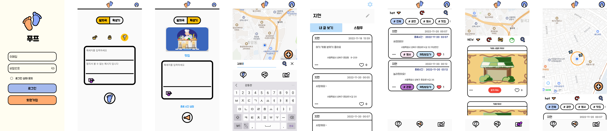

# 푸프 Foop

---

## “공간에 메시지를 더하다”

### 서비스 소개
같은 장소에 머무르는 사람들과 커뮤니티를 형성하여 추억을 남기고 정보를 공유하는 SNS

### 기획 배경
게임 <다크소울>에서 바닥에 메시지를 남기는 시스템에 모티브를 얻어, 나의 추억을 남기고 또한 동네 커뮤니티 역할을 할 수 있는 서비스를 기획하게 되었습니다.

### 이용 타겟
- 장소에 접목된 새로운 형태의 SNS 서비스를 이용해보고 싶은 사람
- 동네 단위의 교류를 원하는 사람

---

## 서비스 화면


## 서비스 영상


[🔗 서비스 소개 영상 보기](https://drive.google.com/file/d/1lq2X2g6CfHrbaAUIg0aTjlhrAjeLky5S/view?usp=sharing)

---

## 프로젝트 개발환경 및 기술 스택

백엔드
▶ Spring
▶ Java 11
▶ gradle
▶ JPA
▶ SockJS
▶ MySql
▶ IntelliJ

프론트엔드
▶ Flutter 3.3.8
▶ Visual Studio Code
▶ Android Studio

서버
▶ AWS
▶ Docker
▶ Nginx 

## 빌드 & 실행

- Spring 빌드
```
$ ./gradlew build
```
- Flutter 빌드
```
$ Flutter build
```
- Flutter appbundle빌드
```
$ Flutter build appbunlde
```
- Flutter 실행
```
$ Flutter run 
```
